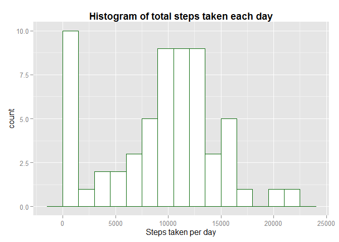
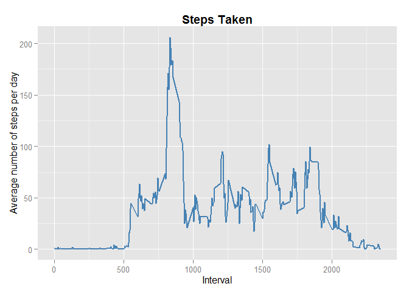
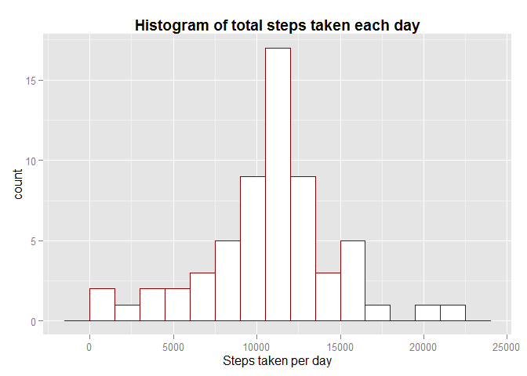
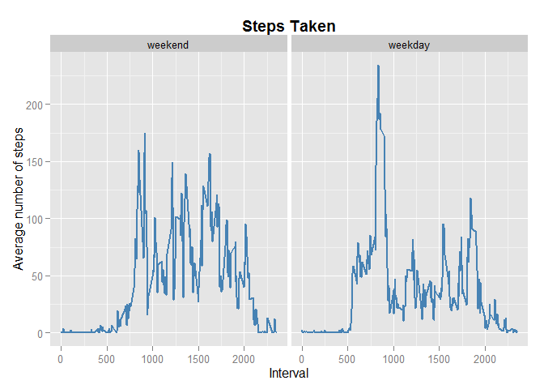

# Reproducible Research: Peer Assessment 1

This is an R Markdown document for the Reproducible Research Peer Assessment 1.


## Loading and preprocessing the data


Load the data
----------------------------------------------------


```r
setwd("~/MOOC/Reproducible Research/Assignment 1")
#fileURL <- "https://d396qusza40orc.cloudfront.net/repdata%2Fdata%2Factivity.zip"
#download.file(fileURL, "data.zip")
#unzip("data.zip")

data<-read.csv("activity.csv")
data$date = as.Date(data$date)
```


The date column is converted as dates

## What is mean total number of steps taken per day?


1. Calculate the total number of steps taken per day
----------------------------------------------------


```r
library(dplyr)
```

```
## 
## Attaching package: 'dplyr'
## 
## The following object is masked from 'package:stats':
## 
##     filter
## 
## The following objects are masked from 'package:base':
## 
##     intersect, setdiff, setequal, union
```

```r
n_steps_day <- data %>%
 group_by(date) %>%
 summarise(
 steps_taken = sum(steps, na.rm = TRUE)
 )

head(n_steps_day)
```

```
## Source: local data frame [6 x 2]
## 
##         date steps_taken
## 1 2012-10-01           0
## 2 2012-10-02         126
## 3 2012-10-03       11352
## 4 2012-10-04       12116
## 5 2012-10-05       13294
## 6 2012-10-06       15420
```


2. Make a histogram of the total number of steps taken each day
----------------------------------------------------


```r
library(ggplot2)

g <- ggplot (n_steps_day, aes(steps_taken))

# add layers
  g + 
  geom_histogram(binwidth = 1500, colour = "darkgreen", fill = "white") +
  labs(x = "Steps taken per day") +
  ggtitle("Histogram of total steps taken each day") +
  theme(plot.title = element_text(lineheight=.8, face="bold"))
```

 

3. Calculate and report the mean and median of the total number of steps taken per day
----------------------------------------------------


```r
n_steps_day %>%
 summarise(
 Mean = mean(steps_taken, na.rm = TRUE),
 Median = median(steps_taken, na.rm = TRUE)
 )
```

```
## Source: local data frame [1 x 2]
## 
##      Mean Median
## 1 9354.23  10395
```

## What is the average daily activity pattern?


1. Make a time series plot 
----------------------------------------------------

To answer this question, we'll first construct a series which averages the steps taken across the days for each of the intervals


```r
n_steps_int <- data %>%
 group_by(interval) %>%
 summarise(
 avg_step = mean(steps, na.rm = TRUE)
 )

head(n_steps_int)
```

```
## Source: local data frame [6 x 2]
## 
##   interval  avg_step
## 1        0 1.7169811
## 2        5 0.3396226
## 3       10 0.1320755
## 4       15 0.1509434
## 5       20 0.0754717
## 6       25 2.0943396
```

Now we will make a time series plot


```r
library(ggplot2)

g <- ggplot(n_steps_int, aes(interval, avg_step))

# add layers
  g + 
  geom_line(col= "steelblue", size = 0.8) +
  labs(x = "Interval") +
  labs(y = "Average number of steps per day") +
  ggtitle("Steps Taken") +
  theme(plot.title = element_text(lineheight=.8, face="bold"))
```

 

2. Which 5-minute interval, on average across all the days in the dataset, contains the maximum number of steps?
----------------------------------------------------


```r
n_steps_int %>%
    filter(avg_step == max(avg_step))
```

```
## Source: local data frame [1 x 2]
## 
##   interval avg_step
## 1      835 206.1698
```

## Imputing missing values


1. Calculate and report the total number of missing values in the dataset 
----------------------------------------------------


```r
colSums(is.na(data))
```

```
##    steps     date interval 
##     2304        0        0
```


2. Devise a strategy for filling in all of the missing values in the dataset.
-----------------------------------------------------------------------------

We'll use the interval average when steps is missing.


3. Create a new dataset that is equal to the original dataset but with the missing data filled in.
--------------------------------------------------------------------------------------------------


```r
data_na <- data

for (i in seq_along(data_na$steps)) {
  if(is.na(data_na$steps[i])) {
    data_na$steps[i]=n_steps_int$avg_step[match(data_na$interval[i],n_steps_int$interval)]
  }
}
```

4. Make a histogram of the total number of steps taken each day and Calculate and report the mean and median total number of steps taken per day.
----------------------------------------------------------------

Making a histogram with the new dataset:


```r
library(ggplot2)

n_steps_day2 <- data_na %>%
 group_by(date) %>%
 summarise(
 steps_taken = sum(steps, na.rm = TRUE)
 )


g <- ggplot (n_steps_day2, aes(steps_taken))

# add layers
  g + 
  geom_histogram(binwidth = 1500, colour = "darkred", fill = "white") +
  labs(x = "Steps taken per day") +
  ggtitle("Histogram of total steps taken each day") +
  theme(plot.title = element_text(lineheight=.8, face="bold"))
```

 

The histogram appears more symmetric around the mean once we replace the NAs. The mean and median total number of steps taken per day are:


```r
n_steps_day2 %>%
 summarise(
 Mean = mean(steps_taken, na.rm = TRUE),
 Median = median(steps_taken, na.rm = TRUE)
 )
```

```
## Source: local data frame [1 x 2]
## 
##       Mean   Median
## 1 10766.19 10766.19
```

Comparing with the previous results when the NAs are simply omitted, both the mean and the median number of steps increase.


## Are there differences in activity patterns between weekdays and weekends?


1. Create a new factor variable in the dataset with two levels - "weekday" and "weekend".
-------------------------------------------------------------------------------------


```r
weekday <- c('Monday', 'Tuesday', 'Wednesday', 'Thursday', 'Friday')

data$WD <- factor((weekdays(data$date) %in% weekday)+1L, levels=1:2, labels=c('weekend','weekday'))
```

2. Make a panel plot containing a time series plot averaged across all weekday days or weekend days (y-axis). 
---------------------------------------------------------------------------------------

We'll first average the data across the Weekdays/Weekends

```r
n_steps_int2 <- data %>%
 group_by(interval,WD) %>%
 summarise(
 avg_step = mean(steps, na.rm = TRUE)
 )
```

Now we will make a time series plot


```r
library(ggplot2)

g <- ggplot(n_steps_int2, aes(interval, avg_step))

# add layers
  g + 
  geom_line(col= "steelblue", size = 0.8) +
  facet_wrap(~WD) +
  labs(x = "Interval") +
  labs(y = "Average number of steps") +
  ggtitle("Steps Taken") +
  theme(plot.title = element_text(lineheight=.8, face="bold"))
```

 


